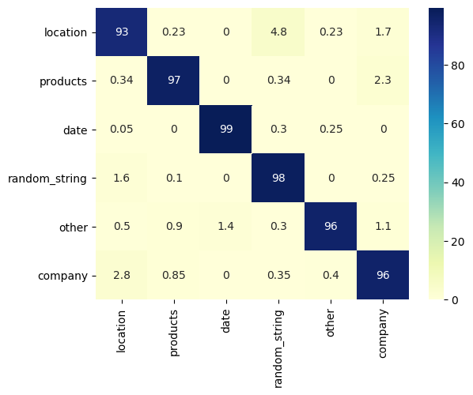
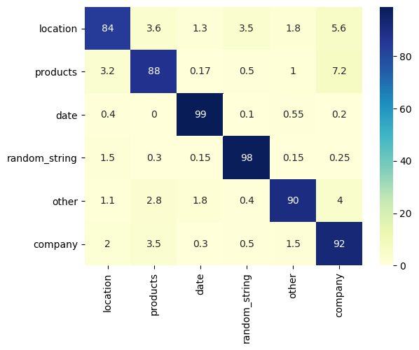

# Text Classification Model

The repository presents a character convolution based text classifier for International trade and logistics data, and categorises the data into the following 6 categories: 
*Location, Company, Product, Date Expressions, Random String (ID numbers etc.), Other*

## Data Collection and Preprocessing

The data for each category was collected from a variety of sources and binned into respective categories, as
 explained in [Data Readme](data/readme.md).
 
 The data was initially preprocessed as detailed by the notebooks at `notebooks
 /*.ipynb`, then clubbed into categories and split into 80-10-10 train, validation and test splits as detailed in `notebooks/split_data.ipynb`. 


As part of preprocessing for the convolutional model, the data samples were often riddled with accentuation and other
 non-ascii characters, and were thus normalised to their closes ascii counterparts using [Unidecode](https://pypi.org
 /project/Unidecode/). Due to various possible case variations, the data was also case normalised to be lower case only. The `utils.Tokenizer` class implements the preprocessing, encoding and decoding functionalities.

## Model


The model is a hybrid character convolution based approach, coupled with bag of words based approach for the token
 level information. The model involves 1D convolutions with kernel sizes 2, 3, and 4 (10 filters per kernel size
 ), followed by a 1D maxpooling and Relu activation. This representation is concatenated with the average pooled
  representation over the word embeddings in the string, and followed by a multilayer perceptron + softmax to output
   the probability distribution over the 6 categories.
   
   The character embeddings are initialized from scratch and learnt along training, whereas the token embeddings are
    initialized with 100 dimensional Glove vectors kept frozen over training.
   
   Also implemented are the ablation of convolution or word embedding representation, and their results compiled. See
    `code/models.py` for more details.
    
## Training
The different variations of the model are trained with CrossEntropy Loss and Adam Optimizer with a learning rate of 1e
-3. 

Early stopping criteria over the validation f-score is implemented with a threshold of 5 degrading epochs. 

The test results are reported at the best performing epoch's model state.
 
 See `code/main.py` for more details, and enter `python main.py -h` to list the
  various configuration options.
    
## Results
The test results of each model ablation are summarized below:

#### Hybrid Approach (Token Embeddings + Character Convolution)
```text
               precision    recall  f1-score   support

     location       0.93      0.91      0.92       878
     products       0.97      0.95      0.96       596
         date       1.00      0.99      0.99      2000
random_string       0.97      0.98      0.98      2000
        other       0.97      0.98      0.97      1004
      company       0.96      0.97      0.97      2000

     accuracy                           0.97      8478
    macro avg       0.97      0.96      0.96      8478
 weighted avg       0.97      0.97      0.97      8478
```

#### Bag of Words Model (Token Embeddings only)

```text
               precision    recall  f1-score   support

     location       0.96      0.63      0.76       878
     products       0.94      0.96      0.95       596
         date       0.99      0.89      0.94      2000
random_string       0.76      1.00      0.86      2000
        other       0.97      0.96      0.97      1004
      company       0.99      0.93      0.96      2000

     accuracy                           0.91      8478
    macro avg       0.94      0.89      0.91      8478
 weighted avg       0.93      0.91      0.91      8478

```

#### Character Convolutions only

```text
               precision    recall  f1-score   support

     location       0.82      0.89      0.85       878
     products       0.84      0.81      0.82       596
         date       0.98      0.98      0.98      2000
random_string       0.98      0.96      0.97      2000
        other       0.91      0.93      0.92      1004
      company       0.94      0.93      0.93      2000

     accuracy                           0.94      8478
    macro avg       0.91      0.92      0.91      8478
 weighted avg       0.94      0.94      0.94      8478

```

## Analysis

Below are the confusion matrices for the above model runs on the test data. The vertical axis represents the
 true class and the horizontal axis represents the
 predicted class. Values are normalized along the true class, and represent the percentage of
  sample predicted as the corresponding label.
 
#### Hybrid



#### Bag of words model


#### Character Convolutional only model


